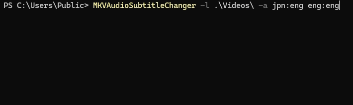

## Introduction

This CLI tool uses MKVToolNix to quickly modify track properties in MKV files without reencoding. Use profiles to set default audio/subtitle tracks and add commentary, hearing impaired, and forced flags in bulk.


## Requirements

 - Java 21 or newer
 - mkvtoolnix installation
 
## Execution
```shell
# Portable
java -jar mkvaudiosubtitlechanger.jar --attribute-config eng:ger -s ./videos
# Installed
mkvaudiosubtitlechanger.jar --attribute-config eng:ger -s ./videos
```
Remove `--safemode` or `-s` to actually apply the changes. Using safemode for the first execution is recommended.

### Update defaults
To update the default flag for tracks use `--attribute-config` or `-a`.
This parameter takes in a list of pairs `audio:subtitle` (E.g. `eng:ger`).
The order of these configs matters, because they are processed in order. 
The matching stops when the first match was found or when no match was found. 
For example `-a ger:OFF eng:ger` first tries to find a match for german audio, if that is not possible it tries the same for english with german subs. 
This can be extended indefinitely.

Using this parameter is not required, but it is the reason I originally started developing this tool.

### Available parameters
```
  -a, --attribute-config=<attributeConfig>...
                            List of audio:subtitle pairs for matching defaults in order (e.g. jpn:eng jpn:ger)
  -m, --mkvtoolnix=<mkvToolNix>
                            path to mkvtoolnix installation
  -s, --safemode            test run (no files will be changes)
  -t, --threads=<threads>   thread count
                              Default: 2
  -c, --coherent=<coherent> try to match all files in dir of depth with the same attribute config. Attempting increasing deeper levels until match is found (worst case applying config on single file basis)
      -cf, --force-coherent only applies changes if a coherent match was found for the specifically entered depth
  -d, --filter-date=<filterDate>
                            only consider files created newer than entered date (format: "dd.MM.yyyy-HH:mm:ss")
  -i, --include-pattern=<includePattern>
                            include files matching pattern
  -e, --exclude=<excluded>...
                            relative directories and files to be excluded (no wildcard)
  -o, -overwrite-forced     remove all forced flags
      --forced-keywords=<forcedKeywords>[, <forcedKeywords>...]...
                            Keywords to identify forced tracks (Defaults will be overwritten)
                              Default: forced, signs, songs
      --commentary-keywords=<commentaryKeywords>[, <commentaryKeywords>...]...
                            Keywords to identify commentary tracks (Defaults will be overwritten)
                              Default: comment, commentary, director
      --hearing-impaired=<hearingImpaired>[, <hearingImpaired>...]...
                            Keywords to identify hearing impaired tracks (Defaults will be overwritten
                              Default: SDH, CC
      --preferred-subtitles=<preferredSubtitles>[, <preferredSubtitles>...]...
                            Keywords to prefer specific subtitle tracks (Defaults will be overwritten)
                              Default: unstyled
      --debug               Enable debug logging
  -h, --help                Show this help message and exit.
  -V, --version             Print version information and exit.
```
If you need more information how each parameter works, check out [this wiki page](https://github.com/RatzzFatzz/MKVAudioSubtitleChanger/wiki/Parameters-v4).

All parameters can also be defined in a [config file](https://picocli.info/#_argument_files_for_long_command_lines).

## Build requirements
- JDK 21 or newer
- Maven 3
- Git

## Build from source
```shell
git clone https://github.com/RatzzFatzz/MKVAudioSubtitleChanger.git
cd MKVAudioSubtitleChanger
mvn clean package -Pportable
```
